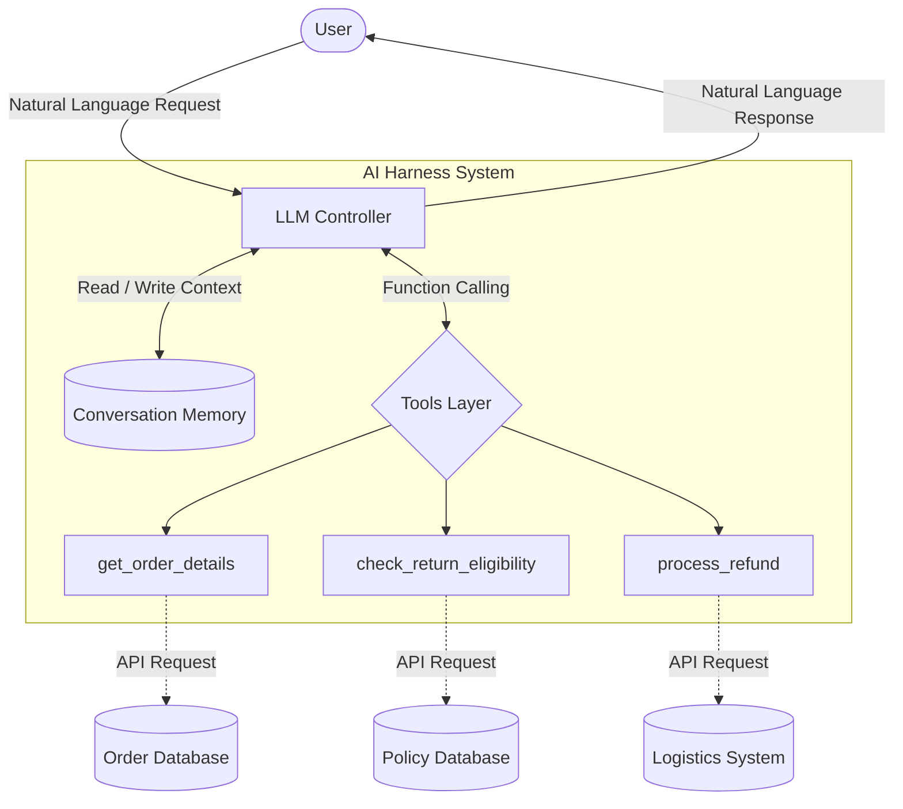
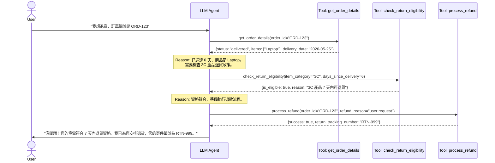
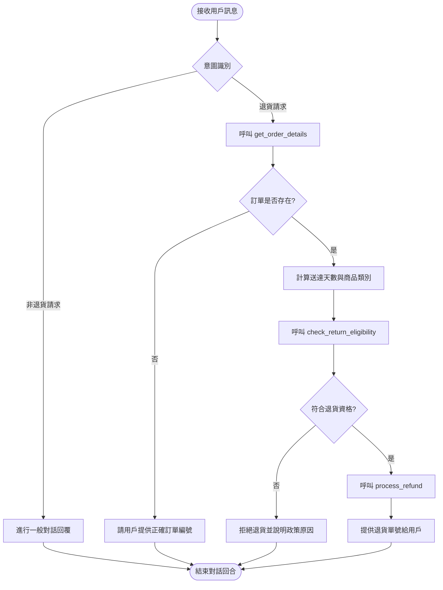

# HW4 Infographics: 智慧電商退換貨客服 Agent

本文件提供 AI Harness
系統的視覺化設計，包含系統架構、工具呼叫序列以及決策流程圖。

## 1. 系統架構圖 (System Architecture)

此架構展示了使用者、LLM 控制器、記憶體與外部工具之間的關係。

## 2. 序列圖 (Sequence Diagram)

展示 Agent 如何運用工具處理用戶的退貨請求。

## 3. 工作流程圖 (Workflow Flowchart)

展示 Agent 內部決策與多步驟執行的邏輯樹。

